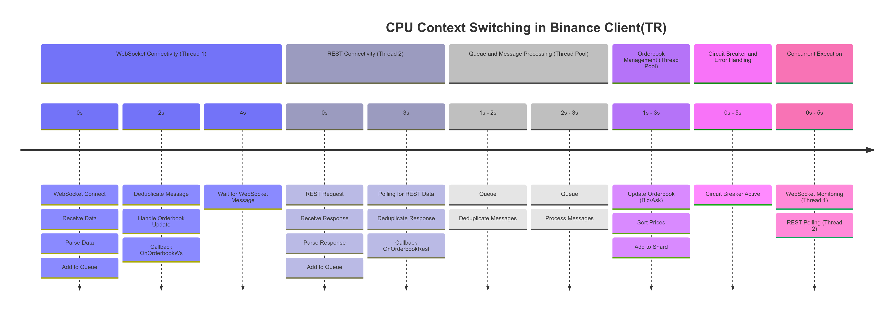

# Binance WebSocket C++ Client

This project provides a C++ client for interacting with Binance's WebSocket and REST APIs, designed to facilitate high-frequency trading applications.

## Features
- **WebSocket and REST Integration**: Supports concurrent WebSocket data streaming and REST API polling for Binance.
- **Order Book Management**: Manages and processes order book data for various trading pairs.
- **Custom Thread Pool**: Efficient handling of concurrent tasks with a custom thread pool implementation.
- **Message Deduplication**: Filters duplicate messages using bloom filters for consistent data.
- **Memory Management**: Uses a custom memory pool for improved performance and resource efficiency.

## Project Structure

1. **Core Modules**:
    - **`BinanceClient.cpp` / `BinanceClient.h`**:
      - The main client class that integrates both WebSocket and REST API capabilities. It manages connection setups, data reception, and interaction with other core components.
    - **`WebSocketHandler.cpp` / `WebSocketHandler.h`**:
      - Manages the connection to Binance's WebSocket endpoint.
      - Handles WebSocket-related events such as connecting, disconnecting, and message processing.
      - Implements reconnection strategies to ensure a persistent data stream.
    - **`RestApiHandler.cpp` / `RestApiHandler.h`**:
      - Manages Binance's REST API requests.
      - Provides functionalities for polling data and executing trades or other commands.
    - **`MessageProcessor.cpp` / `MessageProcessor.h`**:
      - Handles the processing of incoming messages from both WebSocket and REST sources.
      - Uses custom message deduplication logic, likely through `BloomFilter.h`.
    - **`OrderbookManager.cpp` / `OrderbookManager.h`**:
      - Maintains the state of the order book for different trading pairs.
      - Updates order book data based on WebSocket and REST inputs.

2. **Utility Components**:
    - **`ThreadPool.cpp` / `ThreadPool.h`**:
      - Provides thread pool functionality for managing multiple concurrent tasks, ensuring efficient use of resources.
    - **`EventLoop.cpp` / `EventLoop.h`**:
      - Implements an event loop for non-blocking operations, crucial for real-time data handling.
    - **`MemoryPool.h`**:
      - Custom memory management implementation to optimize performance for frequent allocations and deallocations.
    - **`SIMDUtils.h`**:
      - Contains SIMD (Single Instruction, Multiple Data) utility functions for optimizing operations such as data processing and transformations.
    - **`BloomFilter.h`**:
      - Implements a bloom filter, used for fast and memory-efficient duplicate message detection.

3. **Concurrency and Performance Tools**:
    - **`LockFreeQueue.h` / `LockFreePriorityQueue.h`**:
      - Implements lock-free data structures to reduce synchronization bottlenecks.
    - **`Deduplicator.cpp` / `Deduplicator.h`**:
      - Provides additional mechanisms for deduplication, complementing `BloomFilter.h`.

4. **Build Configuration**:
    - **`CMakeLists.txt`**:
      - Configures the project build, defining compilation flags, linking libraries, and organizing project components.
    - **`cmake/FindWebsocketpp.cmake`**:
      - CMake script for finding the WebSocket++ dependency, required for WebSocket handling.

5. **Testing**:
    - **Unit Tests**:
      - **`tests/BinanceClientTest.cpp`**:
        - Tests for the main client interactions.
      - **`tests/WebSocketHandlerTest.cpp`**:
        - Tests WebSocket connection, message handling, and reconnection logic using GoogleTest.
      - **`tests/RestApiHandlerTest.cpp`**:
        - Verifies REST API request handling and polling intervals.
      - **Other Tests**:
        - Unit tests for other components such as `MessageProcessor`, `OrderbookManager`, and utility classes like `ThreadPool` and `EventLoop`.
      - **Testing Framework**: Uses GoogleTest (`gtest`) for writing unit tests, and `gmock` for mocking components where needed.

6. **Miscellaneous**:
    - **`.gitignore`**:
      - Defines files and directories to be ignored by Git version control.
    - **`.vscode/c_cpp_properties.json` / `.vscode/settings.json`**:
      - Configuration files for Visual Studio Code, providing settings for C++ IntelliSense, debugging, and compilation.

## Dependencies
- **Boost.Asio**: Used for asynchronous networking.
- **WebSocket++**: Manages WebSocket communication with Binance servers.
- **C++17 or newer**: Project requires C++17 due to usage of modern language features like smart pointers, lambdas, etc.
- **GoogleTest**: Used for unit testing to ensure the reliability of individual components.

  
### Assignment 1a Solution

#### 1. **Event Loop Handling**
   - **Files Involved**:
     - `BinanceClient.cpp`, `EventLoop.cpp`, `RestApiHandler.cpp`, `WebSocketHandler.cpp`
   - **Current Implementation**:
     - leveraging Boost.Asio (`io_context`) for handling asynchronous tasks, which is a suitable choice for non-blocking operations. Additionally, there are custom event loop implementations to manage the flow of events effectively.
   - **Improvements**:
     - To further improve, consider using `boost::asio::strand` to better coordinate multiple event loops, reducing the risk of race conditions and ensuring smooth concurrency.

#### 2. **Multithreading**
   - **Files Involved**:
     - `BinanceClient.h`, `ThreadPool.cpp`, `EventLoop.cpp`
   - **Current Implementation**:
     - A custom `ThreadPool` is used to manage tasks concurrently, and multithreading has been effectively implemented using C++ standard threading (`std::thread`) and Boost threading utilities.
   - **Improvements**:
     - Improvements could include balancing workloads dynamically across threads, utilizing thread affinity to allocate specific tasks to dedicated cores, and employing a more dynamic thread pool that scales based on the current workload.

#### 3. **Deduplication**
   - **Files Involved**:
     - `BloomFilter.h`, `Deduplicator.cpp`, `MessageProcessor.h`
   - **Current Implementation**:
     - Deduplication is achieved using a combination of bloom filters and a deduplication mechanism that appears to effectively filter out duplicate messages. This is critical in ensuring each callback is unique.
   - **Improvements**:
     - Consider combining bloom filters with additional hashing mechanisms to further reduce false positives, ensuring more precise and reliable message filtering.

#### 4. **Scaling Horizontally**
   - **Files Involved**:
     - `EventLoop.cpp`, `LockFreeQueue.h`, `ThreadPool.h`
   - **Current Implementation**:
     - Including several lock-free data structures (`LockFreeQueue` and `LockFreePriorityQueue`) that help in scaling the solution horizontally by minimizing locking bottlenecks. The use of thread pools further helps to manage multiple symbols concurrently.
   - **Improvements**:
     - Improvements can include splitting symbols across specific CPU cores using CPU affinity to avoid overloading a single core. Implementing a load balancing strategy to distribute symbols across available CPU resources would also enhance horizontal scalability.

#### 5. **Low Latency**
   - **Files Involved**:
     - `SIMDUtils.h`, `LockFreeQueue.h`, `MemoryPool.h`
   - **Current Implementation**:
     - Lock-free queues and custom memory pooling are used to minimize latency, and `SIMDUtils.h` is utilized to perform SIMD optimizations. These techniques help to reduce the overhead involved in data processing and thread synchronization.
   - **Improvements**:
     - To further improve, consider reducing redundant logging and minimizing the number of context switches by binding critical tasks to specific CPU cores. Using a hybrid approach that combines lock-free data structures with fine-grained locks in critical sections could also reduce contention.

#### 6. **Reliability**
   - **Files Involved**:
     - `WebSocketHandler.cpp`
   - **Current Implementation**:
     - The WebSocket handler incorporates a reconnection mechanism (`fail_handler`) and error handling routines to ensure the stability of the WebSocket connections.
   - **Improvements**:
     - Consider implementing a more adaptive reconnection strategy that adjusts reconnection times based on previous failures. Adding redundant WebSocket connections that can take over when a primary connection fails would further enhance system reliability.

## Assignment 1b Answers

### 1. CPU Context Switching Diagram

The diagram provided illustrates how the threading mechanism is utilized across different tasks to ensure efficient CPU context switching and non-blocking operations for WebSocket and REST connectivity.
- The **x-axis** represents the different tasks, including WebSocket connectivity, REST polling, message processing, and orderbook management. The **y-axis** represents time, showing how these tasks are distributed over a given period.

- **WebSocket Connectivity (Thread 1)**: Manages WebSocket operations asynchronously, ensuring that the connection is established and messages are deduplicated before processing. WebSocket updates are triggered through callbacks to keep the order book current.
  - The process begins with **WebSocket Connect**, followed by **Receive Data**, **Parse Data**, and **Add to Queue**. After establishing the connection, the system waits for messages and handles **Deduplicate Message** and **Orderbook Update**, calling the **OnOrderbookWs** callback.

- **REST Connectivity (Thread 2)**: Handles REST API polling periodically. This thread is responsible for retrieving order book information and pushing responses to a queue for further processing.
  - The REST thread initiates with a **REST Request**, **Receive Response**, **Parse Response**, and finally **Add to Queue**. The REST polling repeats at intervals, with deduplication and calling the **OnOrderbookRest** callback.

- **Queue and Message Processing (Thread Pool)**: Handles incoming messages by deduplicating them and processing them through a thread pool, ensuring efficient, concurrent execution without blocking.
  - Messages are deduplicated and queued for processing, reducing the chance of duplicates affecting the integrity of the order book.

- **Orderbook Management (Thread Pool)**: Updates the order book with the processed data from WebSocket and REST sources. This step involves sorting prices and maintaining an up-to-date snapshot of market data.
  - Involves operations like **Update Orderbook (Bid/Ask)**, **Sort Prices**, and **Add to Shard** to maintain accuracy and efficiency.

- **Circuit Breaker and Error Handling**: Provides error handling and circuit breaker logic, ensuring reliability and stable execution.
  - The **Circuit Breaker Active** section handles faults gracefully to prevent cascading failures and allows for smooth reconnection or recovery.

- **Concurrent Execution**: Illustrates how WebSocket monitoring and REST polling occur concurrently without interference.
  - Both **WebSocket Monitoring (Thread 1)** and **REST Polling (Thread 2)** are managed concurrently without blocking each other, thanks to asynchronous operations and proper task scheduling.

Co-existence Without Blocking:

Asynchronous Operations: Both WebSocket and REST threads use asynchronous I/O provided by Boost.Asio. This allows threads to initiate I/O operations and continue without waiting for them to complete.

Thread-safe Queues: Incoming messages are placed into thread-safe queues, preventing contention and ensuring safe communication between threads.

Non-blocking Main Loop: The main thread doesn't perform any blocking operations. It oversees the initialization and can handle other tasks like monitoring or scaling.

Efficient Threading: By dedicating threads to specific tasks and using asynchronous operations, I minimize context switching and CPU overhead.

---
### 2. Potential Bottlenecks and Monitorings

1. **CPU Overload and Thread Efficiency:**
   - **Components Affected:** `ThreadPool.cpp`, `EventLoop.cpp`
   - **Issue:** Multiple threads managing critical tasks such as WebSocket connections, REST polling, and order book updates could overload specific CPU cores, particularly during periods of high market volatility.
   - **Action:** Optimize thread management to distribute load across CPU cores evenly and explore asynchronous programming models to reduce blocking.

2. **Network I/O and Bandwidth Limitations:**
   - **Components Affected:** `WebSocketHandler.cpp`, `RestApiHandler.cpp`
   - **Issue:** High network load due to continuous data streaming and polling may saturate network bandwidth, affecting data timeliness and system responsiveness.
   - **Action:** Implement network traffic management strategies, such as data compression and batching requests to optimize bandwidth usage.

3. **Memory Management Issues:**
   - **General Concern:** High-frequency data handling requires robust memory management to prevent leaks, fragmentation, or crashes due to improper resource allocation.
   - **Action:** Utilize advanced memory profiling and optimization tools to ensure efficient memory use and prevent potential memory-related bottlenecks.

4. **Data Processing Delays and Deduplication Overhead:**
   - **Components Affected:** `MessageProcessor.cpp`, `OrderbookManager.cpp`, `Deduplicator.cpp`
   - **Issue:** Inefficiencies in data processing and deduplication (using Bloom filters and LRU caches) could lead to increased latency, stale data, or processing delays.
   - **Action:** Optimize data processing workflows and enhance deduplication mechanisms with more efficient algorithms or data structures to reduce processing time.

5. **Thread Contention and Synchronization Issues:**
   - **Potential in Multiple Components:** Particularly where shared resources like queues or memory pools are accessed by multiple threads without effective lock-free structures.
   - **Action:** Minimize lock contention by employing finer-grained locking, lock-free data structures, or more granular synchronization techniques.

### Monitoring Strategies to Mitigate and Identify Issues

1. **CPU and Memory Usage:**
   - **Tools:** Use `htop`, Prometheus, and Valgrind to monitor CPU per core and memory usage to quickly identify resource bottlenecks or leaks.

2. **Network Performance Monitoring:**
   - **Tools:** Employ `iftop`, Prometheus, and custom metrics to track network latency, throughput, and error rates, ensuring network health and efficiency.

3. **Concurrency and Lock Contention Monitoring:**
   - **Tools:** Utilize `perf`, Thread Sanitizer, and other concurrency profiling tools to monitor thread performance, detect deadlocks, and reduce contention points.

4. **Data Processing Metrics:**
   - **Tools:** Implement logging and use OpenTelemetry or similar frameworks to measure how long it takes for messages to be processed and to monitor the integrity and timeliness of data.

5. **System Health and Error Logs:**
   - **Action:** Regularly review system logs for errors or anomalies and use tools like Elasticsearch or Splunk for log analysis to provide insights into system behavior and potential underlying issues.

6. **Circuit Breaker Metrics:**
   - **Monitoring:** Keep track of the frequency of circuit breaker activations to understand underlying system stability issues and adjust thresholds as needed to ensure they are not overly sensitive.

---

### 3.Strategies to Improve Latency

To address these bottlenecks and improve overall system latency:

#### 1. Optimize Event Handling
   - **Enhance `EventLoop.cpp`:** Transition from `poll()` to `run()` in Boost Asio's event loop during periods of low activity to reduce CPU usage. Implement adaptive switching between these modes based on current load and task urgency.

#### 2. Network Communication Efficiency
   - **Refine `WebSocketHandler.cpp` and `RestApiHandler.cpp`:**
     - **Connection Pooling:** Implement connection pooling for REST API handlers to reduce the overhead of repeatedly establishing connections.
     - **WebSockets Compression:** Enable compression on WebSocket connections to reduce the amount of data transmitted, decreasing bandwidth usage and potentially reducing latency.
     - **Batch Processing:** Accumulate data packets and process them in batches to minimize per-message overhead and improve throughput.

#### 3. Concurrency and Parallelism
   - **Enhance `ThreadPool.cpp`:**
     - **Dynamic Thread Allocation:** Adjust the number of threads in the pool dynamically based on current workload to ensure optimal use of CPU resources.
     - **Lock-Free Data Structures:** Introduce lock-free queues and other concurrent data structures to reduce thread contention and improve data access times.

#### 4. Data Processing and Storage
   - **Optimize `MessageProcessor.cpp` and `OrderbookManager.cpp`:**
     - **In-Memory Computing:** Use in-memory data structures to speed up data access and manipulation, crucial for order book management.
     - **Data Indexing:** Implement more efficient indexing techniques to speed up data retrieval and updates, which is critical for trading applications.

#### 5. Deduplication Process
   - **Refine `Deduplicator.cpp`:**
     - **Efficient Data Structures:** Evaluate and potentially replace the Bloom filter with more advanced probabilistic data structures that offer a better balance between accuracy, memory usage, and computational overhead.
     - **Parallel Deduplication:** Implement parallel processing techniques for deduplication tasks to distribute the workload more evenly across available resources.

### Monitoring and Testing

- **Performance Profiling:** Regularly profile each component to identify and resolve performance bottlenecks. Tools like `perf`, `Valgrind`, and specialized profiling tools for network and memory can provide insights.
- **Load Testing:** Conduct stress and load testing to observe the system's performance under simulated high-load conditions. This can help identify latent issues that only manifest under stress.
- **Real-Time Monitoring:** Use real-time monitoring tools to continuously track the system’s performance metrics, allowing for immediate adjustments and proactive performance tuning.
